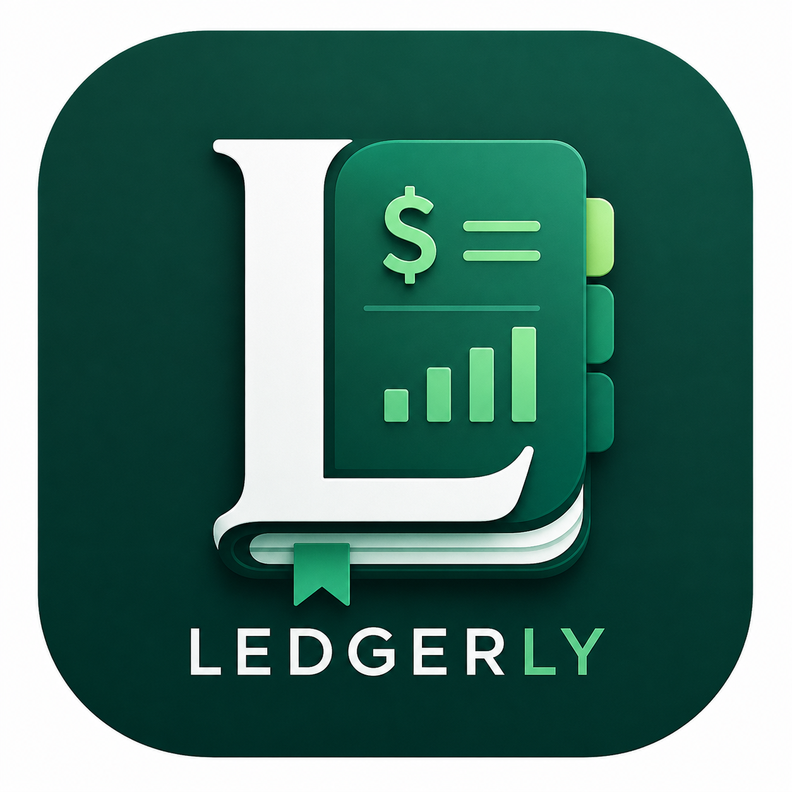

# Ledgerly – Desktop Billing Software

<p align="center">
  
</p>

<p align="center">
  <strong>A lightweight desktop billing application built with Electron, React, and SQLite.</strong>
</p>

---

## ✨ Features

* 🧾 Create and manage invoices
* 📦 Add, edit, and delete products
* 💰 Automatic bill calculations
* 📊 Track sales history
* 📄 Export sales reports as PDF
* 🔒 Simple authentication
* 💾 Local SQLite database (offline support)
* ⚡ Fast desktop experience powered by Electron

---

## 🖥️ Screenshots

> Add screenshots here after your first release.

Example:

```md


```

---

## 🛠️ Tech Stack

* Electron.js
* React
* Vite
* TypeScript
* SQLite (better-sqlite3)
* Electron Builder

---

## 🚀 Getting Started

Clone the repository:

```bash
git clone https://github.com/Punisher-69/Ledgerly-Billing-Software.git
```

Install dependencies:

```bash
npm install
```

Run the application:

```bash
npm run dev
```

Build the application:

```bash
npm run build
```

---

## 📁 Project Structure

```text
.
├── electron/
│   ├── main/
│   └── preload/
├── src/
├── assets/
├── public/
├── package.json
└── README.md
```

---

## 🗄️ Database

Ledgerly uses **SQLite** with **better-sqlite3**, allowing all billing data to be stored locally without requiring an internet connection.

---

## 📦 Releases

Download the latest Windows release from the **Releases** section of this repository.

---

## 🤝 Contributing

Contributions, suggestions, and bug reports are welcome. Feel free to fork the repository and submit a pull request.

---

## 📄 License

This project is licensed under the MIT License.

---

## 👨‍💻 Author

Developed by **Punisher-69**.
